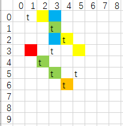

## 第一题

小明想给墙壁贴瓷砖，现将墙壁划分为rows * cols的格子，左上角的格子对应坐标为(0, 0)。  
给定一个矩阵positions，它里面的值就是瓷砖的贴放位置。  
如positions={{1，2}，{2，3}}就代表在第一行第二列会贴一个瓷砖，在第二行第三列也会贴一个瓷砖  
现有一个斜线集合lines={{起点行，起点列，终点行，终点列}}，它里面放的线段可能与地面垂直、平行、成45度、成135度。  
试问，该斜线集合中有多少条线可以被瓷砖***完全覆盖***

#### 示例一

> 输入：row=3, col=4, positions = {{0, 1}, {1, 1}, {2, 2}}, lines = {{1, 1, 2, 2}, {2, 1, 0, 3}}  
> 输入：1

> 解释：从第(1,1)这格135度斜指向(2,2)这格的斜线，它能被瓷砖(1,1), (2,2)完全覆盖；从(2,1)这格45度斜指向(0,3)这格的斜线不会被完全覆盖

#### 示例二

> 输入：row=7, col=6, positions = {{0, 1}, {2, 4}, {1, 3}, {3, 3}, {4, 2}, {5, 5}, {5, 3}, {6, 4}}, lines = {{3, 5, 0, 2}, {0, 3, 2, 3}, {4, 2, 6, 4}, {3, 1, 6, 4}}  
> 输入：1

## 第二题

请设计一个可以让用户租赁存放常温、冷藏物品的存储室系统  
需要注意的是，如果物品已存放超期，需被清空  
可以保证所有的date都是非递减的  
**存放费用 = 存放天数 * 存放价格**  
**过期是指storageDays<=delay**  
**超期是指storageDays>delay**  
**过期时需补缴费用=过期天数 * 存放价格**  
要求如下：

#### 初始化存储室：

> #### class StorageSystem(int coldStorageNum, int coldStoragePrice, int normalStorageNum, int normalStoragePrice, int delay)
>***coldStorageNum***  可以存放的冷藏物品数量  
***coldStoragePrice***  冷藏物品的存放价格  
***normalStorageNum***  可以存放的常温物品数量  
***normalStoragePrice***  常温物品的存放价格  
***delay***  租赁超期delay天后，清空该储物格

#### 存放物品：在date这天给storageId租赁storageType类型的储藏室，并存放storageDays天

如果有空间并存放成功，则预付费用并返回该费用，不存在返回-1
> #### int store(int date, int storageId, int storageType, int storageDays)
>***date***  存放日期  
***storageId***  客户编号，或者可以理解为存放订单号，全局唯一  
***storageType***  存储类型 0冷藏1常温  
***storageDays***  存储天数

> 注：如果物品可以存放在常温柜，当常温柜不够的时候，它也可以存放在冷藏柜，反之不可以

#### 取出物品：在date这天取出storageId存放的物品

如果物品未过期，取出返回并0；若已过期但没超期，取出并返回需补交的费用；如果已超期，返回-1
> #### int retrieve(int date, int storageId)
>***date***  取出日期  
***storageId***  客户编号，或者可以理解为存放订单号，全局唯一

#### 查询库存：返回截止日期为date时3种状态的存单数量序列：已成功取出、未取、被清空

> #### int[] query(int date)
>***date***  截止日期

#### 示例一：

> 输入：  
> {"StorageSystem", "store", "retrieve", "query"}
>
> {{2, 2, 1, 1, 2}, {0, 1, 0, 2}, {3, 1}, {3}}  
> 输出：{null, 4, 2, {1, 0, 0}}

#### 示例二：

> 输入：  
> {"StorageSystem", "query", "store", "store", "store", "query", "store", "retrieve", "store", "query","query", "retrieve"}
>
> {{2, 2, 1, 3, 2}, {0}, {0, 21, 1, 3}, {1, 22, 1, 4}, {1, 23, 0, 2}, {1}, {4, 26, 1, 2}, {5, 21}, {6, 24, 0, 7}, {7}, {8}, {9, 22}}  
> 输出：{null, {0, 0, 0}, 9, 8, 4, {0, 3, 0}, -1, 6, 14, {1, 2, 1}, {1, 1, 2}, -1}

# 第三题

请找出满足以下条件的数组和个数

输入：

cal：数组

size：连续size个数的和

num：几倍

输出：

连续size个数中存在最大值max > 连续size个数的和的平均值 * num 倍

实例1：
> 输入
>
> cal={2,3,100,3,4,6}
>
> size=3
>
> num=2
>
> 输出
>
> 3
>
> 解释：
>
> 2,3,100 平均值 = 35,满足最大值100>35 * 2
>
> 3,100,3 平均值~=35.3,满足最大值100>35*2
>
> 100,3,4 平均值~=35.3,满足最大值100>35*2
>
> 3,4,6 平均值~=4.3,不满足最大值6>4*2
>
> 所有存在3组符合条件

取值

0<cal.len<10^10（大概）

0< size < cal.len

num 不记得了范围了