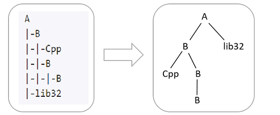

> 来着2月份编程模拟专业级
>
> JDK版本：11

## 第一题

校验和（Checksum）常用在验证一段网络报文或一个文件是否被篡改。假设网络报文每个字节用2位十六进制数字表达，某种**校验和**的计算规则如下：

- 若待校验内容的字节长度不是4的倍数，则在尾部使用值为 0xFF 的字节补齐为4的倍数（最多补充3个字节）。
- 假设补齐后的字节长度除以4，得到一个正整数 n
  - 若 n 等于 1，内容即为校验和；
  - 若 n 大于 1，首先取开头 4 个字节与第5-8字节进行**异或**运算，然后运算结果与随后的 4 个字节继续进行异或运算，直至结束，最后的结果即为校验和。

现给定一段网络报文，请计算并输出其校验和。

###### 输入

十六进制字符串表示的、合法的网络报文，每2个字符（输入仅为[0-9A-F]）表示一个字节，字节之间以单空格分隔；字符串首尾无空格，长度范围：[2, 200]

###### 输出

十六进制字符串形式的校验和， 格式如`0000000A`，说明：

> - 固定8个字符长度（不足8个时，使用前导0补充）；
> - 字母使用大写字母 (A~F)。

###### 样例

- 输入样例1 复制

  ```
  61 62 63 64 32 30 31 32 4C 61 62
  ```

  输出样例1 复制

  ```
  1F3330A9
  ```

  提示样例1

  1.输入报文的字节长度为11。

  2.补齐为4的倍数后为`61 62 63 64 32 30 31 32 4C 61 62 FF`，倍数为3。

  3.每次取4个字节，第一次取得的 0x61626364，与第二次取得的 0x32303132，异或运算结果为 0x53525256，运算结果继续与第三次取得的 0x4C6162FF 进行异或运算。

  4.最后得到十六进制数值 0x1F3330A9 ，结果输出为字符串`1F3330A9`，注意：不用在前面增加0x

- 输入样例2 复制

  ```
  41
  ```

  输出样例2 复制

  ```
  41FFFFFF
  ```

  提示样例2

  输入报文的字节长度为1，补齐后为 41FFFFFF（注意最多补3个FF），即得到校验和，输出为 `41FFFFFF`。

- 输入样例3 复制

  ```
  68 75 61 77 65 69
  ```

  输出样例3 复制

  ```
  0D1C9E88
  ```

  提示样例3

  注意加前导0

###### 提示

异或运算是对两个运算元的一种运算类型，运算法则相当于不带进位的二进制加法，运算符为 ^ 。例如 3 ^ 5 = 6 。

## 第二题

我们定义一种目录结构字符串(类似Windows的 tree /f 的输出内容)，用它来表达目录树的结构，如图所示：


- 目录结构字符串的输入仅含数字、字母和`|-`，其中：|- 表示子目录的层次符号；字母或数字组成目录名（字母大小写敏感）。
- 某一子目录挂接在其前面、最近的上一层目录下。

给定一组目录结构字符串，及待删除的目录名（不含路径）的列表，请按如下要求删除所有符合条件的目录：

- 仅叶子目录，且在待删除的目录名列表中，才可以被删除。

  > 注意：某目录的子目录被全部删除后，也视为叶子目录。

请输出最终被删除的不同路径目录的个数；如果没有被删除的目录，则输出 0。

上图中，如果待删除目录的目录名为`B Cpp`，则输出 4；如果待删除的目录名为`A`，则输出 0。

###### 输入

第1行一个字符串，表示待删除的目录名的列表，多个目录名通过单空格分隔，字符串长度范围 [1,100]； 第2行一个整数 num，表示给定目录结构字符串的行数，取值范围[1,50]； 接下来 num
行字符串，表示给定的目录结构字符串，每行长度范围[1,100]。

用例保证，输入的目录结构是合法的；有且仅有一个根目录；除根目录外，所有目录都有对应的父目录。

###### 输出

一个整数，表示被删除的目录的个数。

###### 样例

- 输入样例1 复制

  ```
  B Cpp
  6
  A
  |-B
  |-|-Cpp
  |-|-B
  |-|-|-B
  |-lib32
  ```

  输出样例1 复制

  ```
  4
  ```

  提示样例1

  A // 根目录 |-B // 第二层目录B，它前面最近的上一层目录为A，因此是A的子目录 |-|-Cpp // 第三层目录Cpp，它前面最近的上一层目录为B，因此是第二层B的子目录 |-|-B //
  第三层目录B，它前面最近的上一层目录为B，因此是第二层B的子目录。 |-|-|-B // 第四层目录B，是第三层B的子目录 |-lib32 // 第二层目录lib32，是A的子目录

  删除目录名为 B 和 Cpp的目录： 目录 /A/B/Cpp 是叶子目录，需要被删除； 目录 /A/B/B/B 是叶子目录，需要被删除；然后/A/B/B 变成叶子目录，也需要被删除； 然后 /A/B也变成叶子目录，同样需要被删除。 共有
  4 个目录被删除。

- 输入样例2 复制

  ```
  A Java
  5
  A
  |-a
  |-|-A
  |-A
  |-|-A
  ```

  输出样例2 复制

  ```
  3
  ```

  提示样例2

  共有 3 个目录（/A/a/A、/A/A/A 和 /A/A ）被删除。 因大小写敏感，a 不是同名的，所以 /A/a 不会被删除；根目录 /A 不会被删除（非叶子目录）。

## 第三题

有些计算机程序存在互斥，两个不能一起运行；我们把一组可随意组合运行（即任意两个程序都不互斥）的程序集合，称为「和谐程序组」。

现给定一组计算机程序信息（程序编号及运行时间），以及互斥清单，请找出符合以下规则的一个和谐程序组，并输出该和谐程序组的所有程序的运行时间之和：

- 规则1：首先和谐程序组的程序数量最多；
- 规则2：如果规则1多解，则找出和谐程序组中所有程序运行时间之和最小的。

###### 输入

首行是一个整数 appNum ，表示计算机程序的数量，程序编号从 1 到 appNum，取值范围 [1,20]
第二行 appNum 个整数，依次表示每个计算机程序的运行时间，运行时间取值范围 [1,100]
第三行是一个整数 mutexNum ，表示互斥的程序对的数量，取值范围 [0, appNum*(appNum-1)/2]
接下来 mutexNum 行，每行一对互斥的程序编号，格式如`NO1 NO2`，程序编号的范围 [1, appNum]

> - 用例保证 mutexNum 行输入中不存在重复的互斥程序对

###### 输出

一个整数，表示满足条件的和谐程序组的程序运行时间之和

###### 样例

- **输入样例1** 复制

  ```
  3
  1 2 10
  1
  1 2
  ```

  输出样例1 复制

  ```
  11
  ```

  提示样例1

  程序 1 与 2 互斥，不能同时存在。可行的组合： 1）程序数量最多为2：分别为 “程序1 + 程序3” ，或 “程序2 + 程序3” 2）两个组合的运行时间之和分别为 11 和 12 因此选择运行之和小的组合为 “程序1 +
  程序3”，并且返回其运行时间之和 11

- **输入样例2** 复制

  ```
  1
  1
  0
  ```

  输出样例2 复制

  ```
  1
  ```

  提示样例2

  只有一个程序，无互斥对，返回这个程序的运行时间


