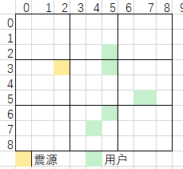

###### 题目描述

某运营商客户基于其通讯能力提供了地震预警服务，假设视某地震多发区域为一个正方形地图，如下所示：



为方便管理，把区域划分为若干个大小相同的栅格Grid（也是正方形），从左到右、从上到下依次编号为`1`，`2`，`3`… `n`

区域左上角单元格位置为`[0, 0]`

单元格边长为 1 。左图的地图边长为 9，栅格边长为 3

当发生地震时（震源是区域内某个单元格），地震预警按照如下通知模型通知用户：

- 以栅格为单位进行通知，仅通知「栅格通知范围」为指定值

  ```
  radius
  ```

  内（含）、且 有用户 的栅格；

  > 「栅格通知范围」：栅格中心点与震源点之间的曼哈顿距离。现约定栅格边长为奇数，即必有一个单元格作为栅格中心点；

- 按照栅格通知范围由近及远依次通知栅格内用户；

- 栅格通知范围相同时，优先通知栅格用户量较多的；

- 栅格用户量也相同时，优先通知栅格编号较小的。

现已知震源位置以及区域内所有用户位置，请按照通知模型依次输出通知的栅格编号。

###### 输入

首行三个正整数 `mapSideLen gridSideLen radius`，分别表示地图边长、栅格边长、栅格通知范围

> 1 <= gridSideLen <= mapSideLen <= 8192，输入保证gridSideLen为奇数
> 1 <= radius <= 16000
> mapSideLen 是 gridSideLen 的整数倍

第二行两个整数`row col`，表示震源发生的单元格位置 第三行一个整数 usersNum，表示用户数，1 <= usersNum <= 1000 接下来 usersNum 行，每行两个整数，表示一个用户所在单元格位置

> 一个单元格内可以有多个用户。

###### 输出

一个整数序列，表示待通知的栅格编号。如果没有符合条件的栅格，请输出空序列 []

###### 样例

- **输入样例1**

  ```
  9 3 6
  3 2
  6
  3 5
  7 4
  6 5
  5 7
  2 5
  5 7
  ```

  输出样例1

  ```
  [5 2 6 8]
  ```

  提示样例1

  输入数据表示的内容参考上图：

    - 与震源距离小于等于通知范围6的栅格编号为1、2、4、5、6、7、8 号；其中有用户的栅格为 2、5、6、8号，与震源的曼哈顿距离分别为 4、3、6、6。
    - 首先按由近及远通知，先通知5号、2号；对于6号和8号，依次比较距离和用户数，都相同，则按栅格编号从小到大先通知 6号。

- **输入样例2**

  ```
  3 1 3
  0 0
  1
  2 2
  ```

  输出样例2

  ```
  []
  ```

  提示样例2

  没有符合条件的栅格，输出空序列

###### 提示

点P1位置(x1,y1)与点P2坐标(x2,y2)**曼哈顿距离**=|x1-x2|+|y1-y2|