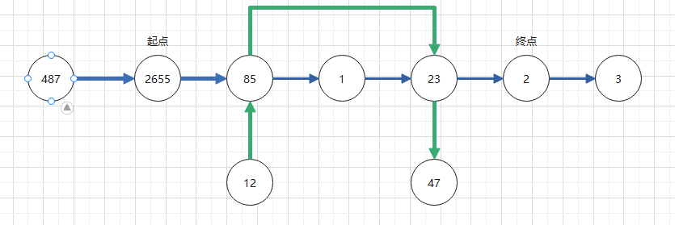

###### 题目描述

CBG地图业务提供一个地铁线路的智能搜索功能，需要找出从起点到终点的最佳路线方案，规则如下：

- 每条地铁线路都包含一系列站点（可能为环形），不同线路之间的相同站点为换乘站，地铁为双向运行。
- 最佳路线首先是指经过的站点最少；如果经过的站点一样多，则取换乘次数最少的路线。

给定一系列地铁线路，以及指定的起点和终点，请找出最佳路线方案，并返回其经过的站点数量和换乘次数；如果从起点到终点找不到路线，返回-1 -1 。

> - 例如：11 <—> 12 <—> 13 <—> 14 ，站点11到14经过的站点数为 3，11到12经过的站点数为 1
> - 最佳路线方案可能有多条，但是因为经过的站点数量和换乘次数都相同，因此返回结果是一样的

###### 输入

第一行一个整数 num ，表示给定的地铁线路的数量，取值范围 1 <= num <= 100 接下来 num 行，每行表示一条地铁线路：第一个数为该条线路的站点数量 m，后面跟着 m 个站点编号，1 <= m <= 100，0 <=
站点编号 < 10000 最后一行两个整数 `start end` ，表示给定的起点和终点的站点编号。

> 每个换乘站点的最大换乘线路数小于 10

###### 输出

两个整数，表示最佳路线方案所经过的站点数量和换乘次数；如果找不到，则返回 -1 -1

###### 样例

- **输入样例1**

  ```
  2
  4 12 85 23 47
  7 487 2655 85 1 23 2 3
  2655 2
  ```

  输出样例1

  ```
  3 2
  ```

  提示样例1

  示意图如下：
  

    - 方案1：沿线路2（蓝色）无换乘，经过4个站点。
    - 方案2：从线路2出发，经站点85换乘线路1，经过1站到站点23换乘线路2，然后经过1站到达终点，共经过3个站点，换乘2次。

  因此最佳路线所经过的站点数量为3、换乘次数为2，输出 3 2

- **输入样例2**

  ```
  3
  8 1011 1003 1007 1009 1022 1018 1002 1011
  4 1010 1011 1026 1025
  3 1026 1018 1028
  1010 1022
  ```

  输出样例2

  ```
  4 1
  ```

  提示样例2

    - 方案1：经过 1 站到1011换乘，然后去往1022有两个选择：1）从右向左经过 3 站到达；2）从左向右经过 4 站到达，因此选择从右向左，该方案共经过站点数为 4，换乘次数为 1 。
    - 方案2：经过 2 站到1026换乘，再经过 1 站到1018换乘，然后经过 1 站到达；共经过站点数为 4，换乘次数为 2。

  方案1和方案2的站点数相同，取换乘次数少的，因此方案1为最佳。输出 4 1

  > 注：线路1的第一个和最后一个站点编号相同，表示该线路为环形

- **输入样例3**

  ```
  2
  2 12 47
  4 487 2655 85 3333
  47 3333
  ```

  输出样例3

  ```
  -1 -1
  ```

  提示样例3

  站点47 与 3333 之间找不到路线可达，因此输出 -1 -1