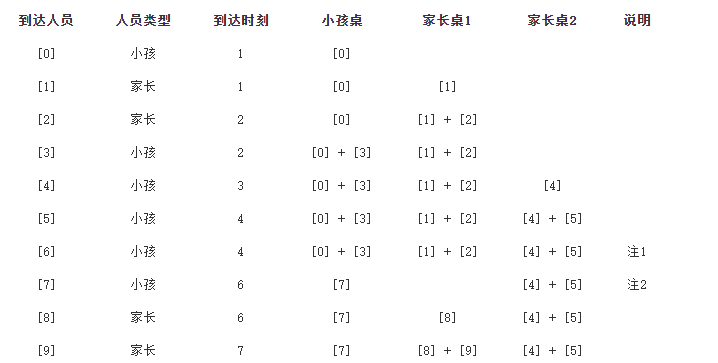

研究所FamilyDay有一项围棋活动，一共有 num 张围棋桌，分为两种桌：小孩桌和家长桌

其中有 cnt 张小孩桌，其余为家长桌，初始所有围棋桌均空闲。

陆续有人员到围棋区下棋，按到达时刻先后顺序以 [到达时刻，是否为小孩] 格式记录于二维数组 people 中 。

是否为小孩 仅为 0 或 1。其中1 表示小孩， 0 表示家长。

围棋对弈规则如下：

1. 小孩可使用两种桌，家长仅可使用家长桌；

2. 优先对弈

    + 小孩与最早等待的人员对弈（含两种桌等待的人员）；

    + 家长只能与在家长桌等待的人员对弈（等待人员有可能是家长或小孩）；

3. 若无法对弈，则试图占用一个桌子并等待；若无桌可用，则直接离开

    + 小孩优先占用小孩桌，若无小孩桌则可占用家长桌；

    + 家长只能占用家长桌；

假设每桌对弈持续 time 单位时间，完成对弈后两人均离开并空出桌子。

请计算并返回每位到达人员对弈的开始时刻；对于不能对弈（即离开棋馆或一直等待）的人员，则标识为 -1。

注意： 相同时刻到达的人员，按下标先后顺序依次处理。

###示例 1：

输入：

num = 2

cnt = 1

time = 3

people = [[1,0],[1,1],[2,1],[2,0]]

输出：[1,1,-1,-1]

解释：

有 2 张围棋桌，其中 1 张仅面向小孩开放；

[1,0]，时刻 1 ：一位家长到达，占用 1 个家长桌并处于等待中；

[1,1]，时刻 1 ：一位小孩到达，与在时刻 1 等待的家长开始对弈；

[2,1]，时刻 2 ：一位小孩到达，占用 1 个小孩桌并处于等待中，后续没有人加入，不能正常开始；

[2,0]，时刻 2 ：一位家长到达，到达时无空闲桌（家长不能与在小孩桌等待的人员对弈），离开并空出桌子。

因此返回 [1,1,-1,-1]

###示例 2：

输入：

num = 3

cnt = 1

time = 4

people=[[1,1],[1,0],[2,0],[2,1],[3,1],[4,1],[4,1],[6,1],[6,0],[7,0]]

输出：[2,2,2,2,4,4,-1,-1,7,7]

解释：
有 3 张围棋桌，其中 1 张仅面向小孩开放；

[x]：表示people[x]

注1：来的人员是小孩，发现没有等待对弈的人，其次去找空闲的小孩桌，也没有；然后去找空闲的家长桌，也没有；最后直接离开

注2：先处理离开，再处理新来人员，如时刻 2 开始对弈的小孩桌，在 2 + time = 6 时刻时对弈结束离开桌子，此时桌子空出，在时刻 6 到达的 people[7] 可以占用该桌

最后people[7]处于等待状态，后续无小孩到达，无法开始棋局，需要返回 -1
因此返回 [2,2,2,2,4,4,-1,-1,7,7]

提示：

1 <= time <= 10^5

0 <= cnt <= num <= 100

1 <= people.length <= 1000

1 <= people[i][0] <= 10^5

任意 0 <= i < j < people.length, 均满足 people[i][0] <= people[j][0]

people[i][1] 仅为 0 或 1