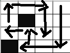

###### 题目描述

有一边长为slider的正方形房间，被划分成了多个单元格子

现放一个扫地机器人进去打扫房间，已知该机器人可以前进，左转，右转

但不能走已走过的地方，并且在遇到边界或者障碍物时方可转弯

请选择合适的位置放下机器人，使其能清扫的路径最长，输出该最长路径的值


###### 样例

- **输入样例1**

  
  ```
  slider=4
  obstacles={{1,1}, {3,0}}
  ```

- *输出样例1*

  ```
  14
  ```
- *提示样例1*
  如图所示