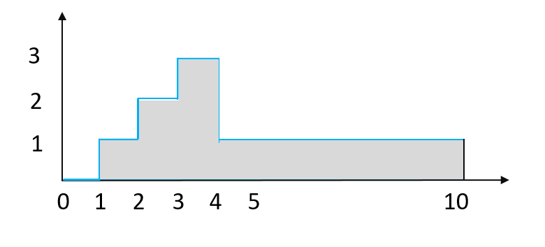
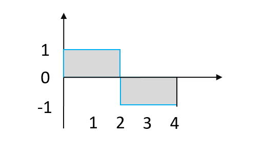

> https://oj.rnd.huawei.com/problems/1788/details
# 1788. 【认证试题】计算面积

**题目描述**

绘图机器的绘图笔初始位置在原点（0, 0），机器启动后其绘图笔按下面规则绘制直线：
1）尝试沿着横向坐标轴正向绘制直线，直到给定的终点值E。
2）期间可通过指令在纵坐标轴方向进行偏移，并同时绘制直线，偏移后按规则1 绘制直线；指令的格式为`X offsetY`，表示在横坐标X 沿纵坐标方向偏移，offsetY为正数表示正向偏移，为负数表示负向偏移。

给定了横坐标终点值E、以及若干条绘制指令，请计算绘制的直线和横坐标轴、以及 X=E 的直线组成图形的面积。

**解答要求**时间限制：1000ms, 内存限制：256MB

**输入**

首行为两个整数 `N` `E`，表示有`N`条指令，机器运行的横坐标终点值`E`。
接下来`N`行，每行两个整数表示一条绘制指令`X offsetY`，用例保证横坐标 X 以递增排序方式出现，且不会出现相同横坐标 X 。
取值范围：0 < N <= 10000, 0 <= X <= E <= 20000, -10000 <= offsetY <= 10000。

**输出**

一个整数，表示计算得到的面积，用例保证，结果范围在 0~4294967295 内

**样例**

输入样例 1 复制

```
4 10
1 1
2 1
3 1
4 -2
```

输出样例 1

```
12
```

提示样例 1


输入样例 2 复制

```
2 4
0 1
2 -2
```

输出样例 2

```
4
```

提示样例 2


**提示**

【样例1解释】
通过操作机器最后绘制了如下图形（蓝色为绘制笔绘制的直线）

计算图中阴影部分面积，其值为`1*1+2*1+3*1+1*6=12`

【样例2解释】
通过操作机器最后绘制了如下图形

计算图中阴影部分面积，其值为`1*2+1*2=4`

```java
/*
 * Copyright (c) Huawei Technologies Co., Ltd. 2019-2020. All rights reserved.
 * Note: 提供的缺省代码仅供参考，可自行根据答题需要进行使用、修改或删除。
 */

import java.nio.charset.StandardCharsets;
import java.util.ArrayList;
import java.util.List;
import java.util.Scanner;

/**
 * OJ考题代码：计算面积
 *
 * @author 命题组
 * @since 2020-03-20
 */

public class Main {
    /**
     * main入口由OJ平台调用
     */
    public static void main(String[] args) {
        Scanner cin = new Scanner(System.in, StandardCharsets.UTF_8.name());
        int row = cin.nextInt();
        int stopPoint = cin.nextInt();
        int[][] operations = new int[row][2];
        for (int i = 0; i < row; i++) {
            for (int j = 0; j < 2; j++) {
                operations[i][j] = cin.nextInt();
            }
        }
        cin.close();
        long result = getMinArea(stopPoint, operations);
        System.out.println(result);
    }

    // 待实现函数，在此函数中填入答题代码
    private static long getMinArea(int stopPoint, int[][] operations) {
            // 记录当前笔坐标
            long x = 0;
            long y = 0;
            long areaSum = 0;
            for (int[] operation : operations) {
                int moveX = operation[0];
                int moveY = operation[1];
                if (x == 0 && y == 0) {
                    x = moveX;
                    y += moveY;
                } else {
                    long kuan = Math.abs(moveX - x);
                    areaSum += kuan * Math.abs(y);
                    x = moveX;
                    y += moveY;
                }
            }
            if (x != stopPoint) {
                long kuan = Math.abs(stopPoint - x);
                areaSum += kuan * Math.abs(y);
            }
            return areaSum;
        }
}
```

