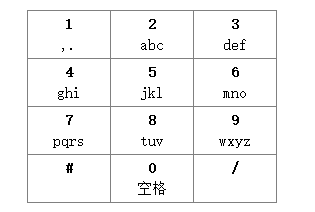

**1903. 【认证试题】手机九宫格输入法**

**题目描述**

手机上的九宫格输入法使用 0-9 十个数字键，除了可以在“数字状态”下输入数字外，还可以在“英文状态”下通过连续多次摁某一数字键来输入对应的英文字符。每个数字键可输入的字符对应关系如图：


说明：

- 输入法初始默认为“数字状态”，并可在“数字状态”与“英文状态”间切换。
- 输入法在“数字状态”下，数字键对应为单个数字，摁几次显示几个该数字。
- 输入法在“英文状态”下，如果数字键为 0，则对应为单字符（空格），摁几次显示几个该字符。
- 输入法在“英文状态”下，如果数字键为非 0，则对应为多个字符，可通过连续多次快速摁该键循环选择对应字符：
    - 以英文状态下的数字键 2 为例，摁1次为 `a` ，2次为 `b` ，3次为 `c` ，4次又循环回 `a` 。
    - 若连续多次摁键循环选择时被其它键或停顿中断，则输出所选择的字符。

现给定一个仅含字符集合为 [0-9#/] 的字符串，表示用户的摁键操作，请输出实际显示出来的字符串。

> - 0-9 为数字键。
> - \#  表示在“数字状态”与“英文状态”之间切换。
> - /  停顿符，表示用户有意停顿。

**解答要求**时间限制：1000ms, 内存限制：128MB

**输入**

一个字符串，表示用户的摁键操作，长度范围 [1,200]

**输出**

实际显示出来的字符串

**样例**

输入样例 1 复制

```
123
```

输出样例 1

```
123
```

提示样例 1

输入法默认为“数字状态”，每个数字键都对应单个字符，摁键即为实际显示出来的字符串，因此输出 `123` 。


输入样例 2 复制

```
#22/23044444411
```

输出样例 2

```
bad i.
```

提示样例 2

\# 表示输入法切换为“英文状态”；
数字键 2 摁2次后被停顿符 / 中断，显示 `b` ；
其后，数字键 2、3、0 各摁1次后被其它键中断，显示 `a`、`d`、空格 ；
然后，数字键 4 摁6次后中断，显示 `i` ；
最后，数字键 1 摁2次后结束，显示 `.` 。

因此，实际显示出来的字符串为 `bad i.`