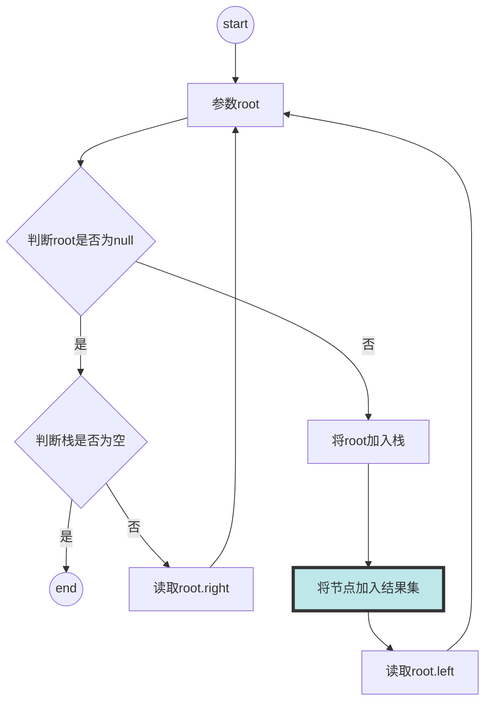
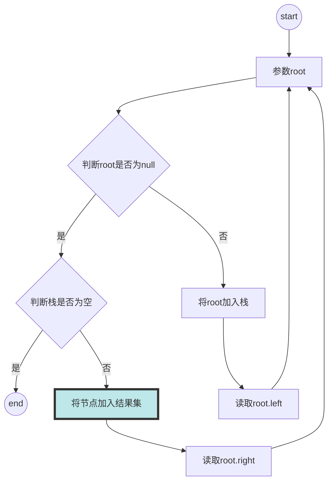
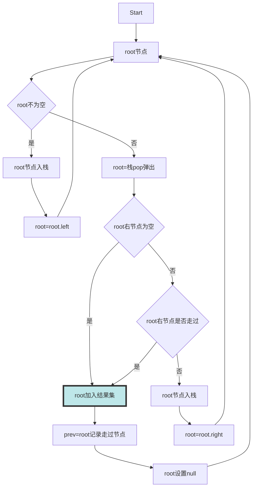

## 前序遍历

```mermaid
flowchart TB
id1((start)) --> id1_1[参数root]
id1_1 --> id2{判断root是否为null}
id2 -->|是| id3{判断栈是否为空}
id3 -->|是| id4((end))
id3 -->|否| id6[读取root.right]
id6 --> id1_1

id2 -->|否| id7[将root加入栈]
id7 --> id5[将节点加入结果集]
id5 --> id8[读取root.left]
id8 --> id1_1

style id5 fill:#BEE7E9,stroke:#333,stroke-width:4px
```

## 中序遍历

```mermaid
flowchart TB
id1((start)) --> id1_1[参数root]
id1_1 --> id2{判断root是否为null}
id2 -->|是| id3{判断栈是否为空}
id3 -->|是| id4((end))
id3 -->|否| id5[将节点加入结果集]
id5 --> id6[读取root.right]
id6 --> id1_1

id2 -->|否| id7[将root加入栈]
id7 --> id8[读取root.left]
id8 --> id1_1

style id5 fill:#BEE7E9,stroke:#333,stroke-width:4px
```

## 后续遍历

```mermaid
flowchart TB
Start --> root节点
root节点 --> root不为空{root不为空}
root不为空 -->|是| root节点入栈
root节点入栈 --> 节点取左[root=root.left]
节点取左 --> root节点

root不为空 -->|否| 栈pop弹出[root=栈pop弹出]
栈pop弹出 --> root右节点为空{root右节点为空}
root右节点为空 --> |是| id_3[root加入结果集]
root右节点为空 --> |否| root右节点是否走过{root右节点是否走过}
root右节点是否走过 --> |是| id_3[root加入结果集]
id_3 --> id_2[prev=root记录走过节点]
id_2 --> root设置null
root设置null --> root节点
root右节点是否走过 --> |否| id_1[root节点入栈]
id_1 --> 节点取右[root=root.right]
节点取右 --> root节点

  
style id_3 fill:#BEE7E9,stroke:#333,stroke-width:4px
```

